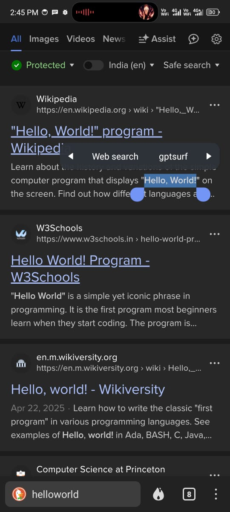

# gpt_surf

---

## 🌟 Key Features

### android

* **No playstore required:** Use chatgpt without gapps.
* **Lightweight:** Lesser in size, takes less space.
* **Voice mode:** Voice mode like native mobile apk.
* **Action menu:** Action menu enabled, select and go..
* **Download image :** download image by holding it.

## 🌟 Upcoming Features

* **Offline support :** Offline support chat retrival.
* **Voice activation on android(coming soon), :**  Voice activation on android(coming soon).
* **Support for macos x86 :** Support for macos x86(coming soon).
* **Support for windows:** Support for windows (coming soon).
* **Support for windows (coming soon) :** Support for windows (coming soon).

## 🎯 Usage

1. **Download from releases** on your device.
2. **Install** Install apk on your devices.
3. **Sign in** if you want (optional).
4. **Start Chating**.

---

## 🤝 Contributing

Contributions are welcome! To propose a feature or fix an issue:

1. Fork the repository.
2. Create a new branch: 
3. Commit your changes: 
4. Push to the branch: 
5. Open a pull request.

